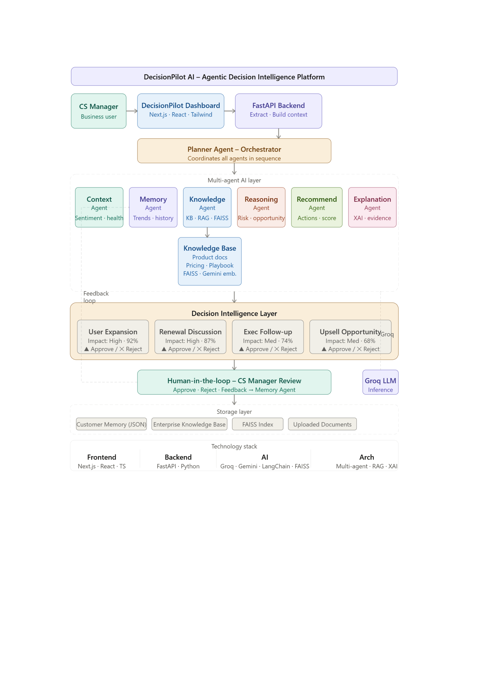

# 🚀 DecisionPilot AI

## Agentic Decision Intelligence Platform for Customer Success

DecisionPilot AI is an AI-powered **Agentic Decision Intelligence Platform** that transforms customer interactions and enterprise knowledge into actionable business recommendations.

Unlike traditional chatbots, DecisionPilot AI uses multiple specialized AI agents that collaboratively understand customer context, retrieve enterprise knowledge, perform business reasoning, and recommend the **Next Best Actions** with explainable insights and confidence scores.

---

# 📌 Problem Statement

Customer Success Managers receive information from multiple disconnected sources such as:

* 📄 Meeting Transcripts
* 🗂 CRM Records
* 📧 Customer Emails
* 📚 Enterprise Knowledge Base

Manually analyzing these sources is time-consuming and often leads to delayed or inconsistent business decisions.

Organizations need an intelligent platform capable of understanding customer context, retrieving enterprise knowledge, performing business reasoning, and recommending the next best actions while keeping humans in control of the final decision.

---

# 💡 Our Solution

DecisionPilot AI solves this challenge using a reusable **Multi-Agent AI Platform**.

The platform can:

* Understand customer interactions
* Retrieve enterprise knowledge using RAG
* Compare historical customer interactions
* Perform intelligent business reasoning
* Generate explainable recommendations
* Predict customer health
* Assess business risk
* Provide confidence scores
* Enable Human-in-the-Loop approval before execution

---

# ✨ Key Features

* 🤖 Multi-Agent AI Architecture
* 📄 Meeting Transcript Analysis (PDF/TXT)
* 🗂 CRM Record Analysis (JSON/TXT)
* 📧 Customer Email Analysis (TXT)
* 🧠 Customer Context Understanding
* 💾 Historical Customer Memory Comparison
* 📚 Enterprise Knowledge Retrieval (RAG + FAISS)
* 📊 Customer Health Score Prediction
* 😊 Sentiment Analysis
* ⚠ Business Risk Assessment
* 🎯 Top 5 AI-Powered Next Best Actions
* 💡 Explainable Recommendations
* 📈 Confidence Score Generation
* 👨‍💼 Human-in-the-Loop Approval
* 📊 Interactive Analytics Dashboard

---

# 🛠 Tech Stack

## Frontend

* Next.js
* React
* TypeScript
* Tailwind CSS
* Framer Motion

## Backend

* FastAPI
* Python

## AI & Agent Framework

* LangGraph
* Groq LLM
* Agentic AI Architecture

## Retrieval-Augmented Generation

* FAISS Vector Database
* Sentence Transformers

## Document Processing

* PyPDF
* JSON
* TXT

---

# 🤖 Multi-Agent Workflow

### 1️⃣ Planner Agent

Coordinates the workflow and orchestrates communication between all specialized agents.

### 2️⃣ Context Agent

* Extracts customer health score
* Detects sentiment
* Identifies risks and opportunities
* Generates meeting insights

### 3️⃣ Memory Agent

* Retrieves previous customer interactions
* Compares historical and current context
* Detects customer trends

### 4️⃣ Knowledge Agent

* Searches enterprise knowledge
* Retrieves company policies
* Uses RAG for contextual information

### 5️⃣ Reasoning Agent

* Combines customer context, memory, and enterprise knowledge
* Evaluates business risks
* Calculates confidence score
* Identifies opportunities

### 6️⃣ Recommendation Agent

Generates the **Top 5 Next Best Actions**, prioritizes them, and assigns confidence scores.

### 7️⃣ Explanation Agent

Explains why each recommendation was generated, improving transparency and trust.

---

# 🏗️ System Architecture



---

# 📂 Project Structure

```text
DecisionPilotAI
│
├── backend
│   ├── agents
│   ├── config
│   ├── knowledge_base
│   ├── memory
│   ├── rag
│   ├── utils
│   ├── models
│   ├── main.py
│   └── requirements.txt
│
├── frontend
│   └── decision-pilot-ai-dashboard
│       ├── app
│       ├── components
│       ├── lib
│       ├── public
│       ├── package.json
│       └── tsconfig.json
│
├── sample_data
│
├── README.md
│
└── assets
    └── Architecture.png
```

---

# ⚙️ Installation & Setup

## Backend

```bash
cd backend

python -m venv venv

venv\Scripts\activate

pip install -r requirements.txt

uvicorn main:app --reload
```

Backend:

```
http://localhost:8000
```

---

## Frontend

```bash
cd frontend/decision-pilot-ai-dashboard

npm install

npm run dev
```

Frontend:

```
http://localhost:3000
```

---

# 📂 Sample Inputs

The `sample_data/` folder contains sample files for testing.

| File                             | Description                               |
| -------------------------------- | ----------------------------------------- |
| Positive_Customer_Transcript.pdf | Happy customer with expansion opportunity |
| Negative_Customer_Transcript.pdf | Customer showing churn risk               |
| Positive_CRM_Record.json         | Healthy customer CRM data                 |
| Negative_CRM_Record.json         | At-risk customer CRM data                 |
| positive_email.txt               | Positive follow-up email                  |
| negative_email.txt               | Customer complaint email                  |

Simply upload these files through the dashboard to test the platform.

---

# 🎯 Business Use Case

DecisionPilot AI enables Customer Success Managers to:

* Predict customer health
* Detect churn risks early
* Identify expansion opportunities
* Recommend the next best actions
* Provide explainable AI insights
* Support Human-in-the-Loop decision making
* Improve consistency and speed of business decisions

---

# 🚀 Future Enhancements

* Multi-language customer support
* CRM integration (Salesforce, HubSpot)
* Slack & Microsoft Teams integration
* Real-time meeting transcription
* Predictive revenue analytics
* Automated workflow execution
* Continuous customer monitoring

